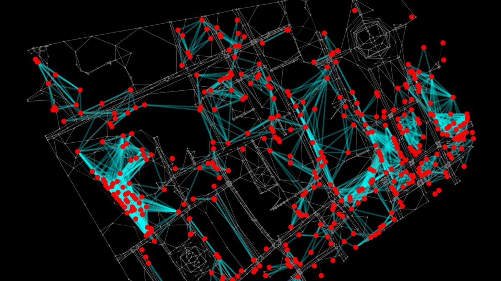
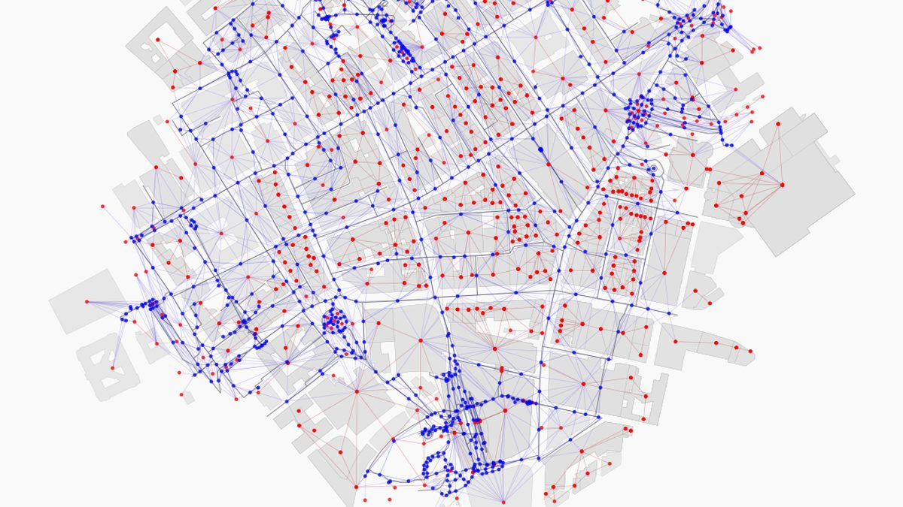
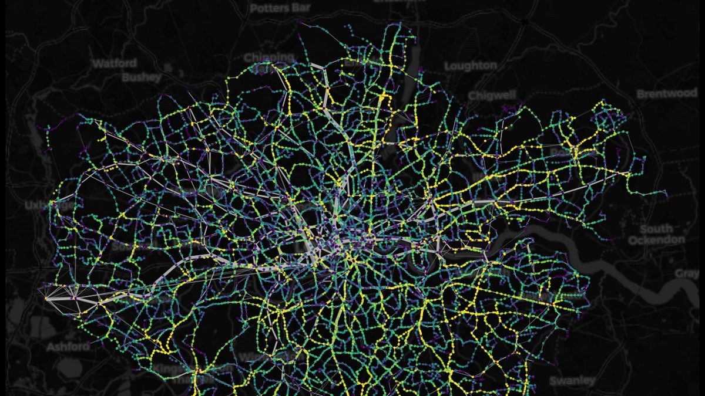
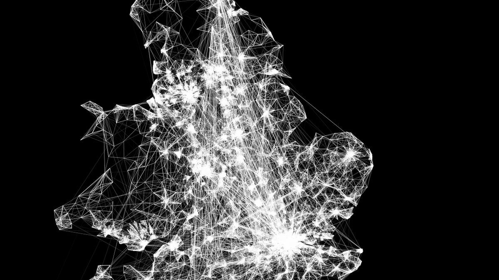
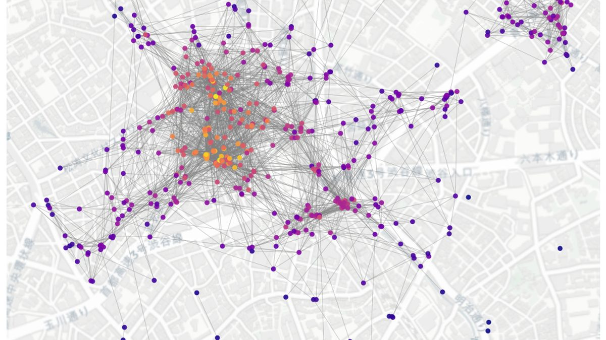
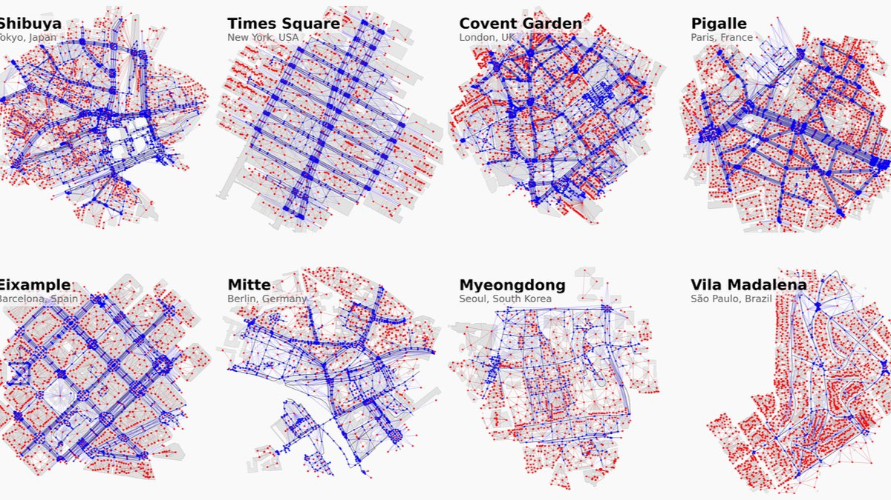
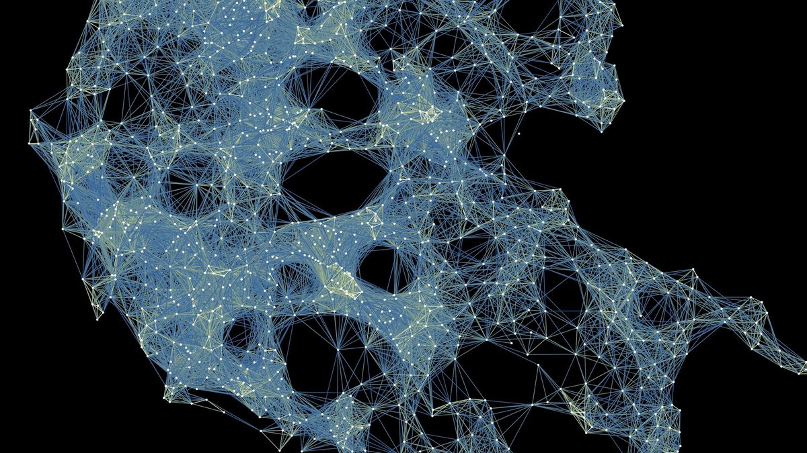
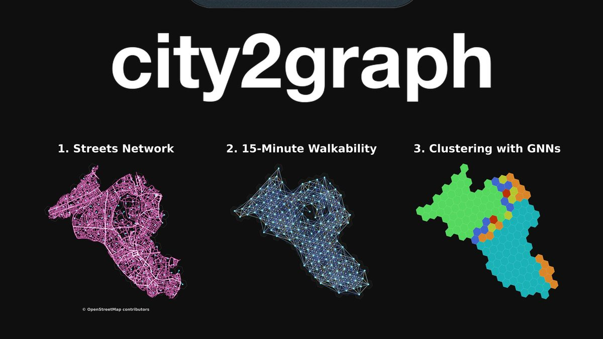

# Examples

Each tutorial below is a self-contained Jupyter notebook that starts from open data and ends with a graph you can analyse or feed to a graph neural network. The [case study](#applied-projects) and [workshop](#applied-projects) show the library applied end to end.

## Tutorials

- { .card-img }

    **[Metapath Construction for Heterogeneous GNNs](add_metapaths.ipynb)**

    ---

    Build a dual graph of Soho's street network, attach amenities to their nearest segments, and materialise metapath edges between amenities reachable within a few street hops — the composite relations used by heterogeneous GNNs.

- { .card-img }

    **[Morphological Graphs from Overture Maps & OpenStreetMap](morphological_graph_from_overturemaps.ipynb)**

    ---

    Tessellate Liverpool's urban fabric into private and public space, link it to the street network, and export the resulting heterogeneous graph to NetworkX and PyTorch Geometric. Works from both Overture Maps and OSM data.

- { .card-img }

    **[GTFS to Public Transit Graphs](gtfs.ipynb)**

    ---

    Convert a raw GTFS feed for London into a stop-to-stop travel-time graph, rank stops by betweenness centrality, and draw walk and walk-plus-transit isochrones around chosen origins.

- { .card-img }

    **[OD Matrices to Mobility Graphs](generating_graphs_from_od_matrix.ipynb)**

    ---

    Turn origin–destination data — edge lists or adjacency matrices — into spatial graphs, from a toy grid up to the 2021 census migration flows between all MSOAs of England and Wales.

- { .card-img }

    **[Spatial Proximity Graphs](generating_graphs_by_proximity.ipynb)**

    ---

    Generate k-nearest-neighbour, Delaunay, Gilbert, and Waxman graphs over Tokyo points of interest, compare Euclidean, Manhattan, and network distances, and apply contiguity graphs to London wards.

- { .card-img }

    **[How to Use Overture Maps Like OSMnx](https://medium.com/@yuta.sato.now/how-to-use-overture-maps-like-osmnx-by-city2graph-7e01d38f9f61)**

    ---

    Bring the OSMnx-like experience to Overture Maps: fetch buildings, streets, and POIs for any place and turn them into analysis-ready graphs — a walkthrough on Medium.

## Applied projects

- { .card-img }

    **[Liverpool Case Study](https://github.com/c2g-dev/city2graph-case-study)**

    ---

    A reproducible research pipeline for Liverpool: open data are processed into heterogeneous graphs, graph autoencoders are trained on them, and the resulting embeddings are clustered and evaluated to characterise urban structure.

- { .card-img }

    **[Workshop: From Geospatial Data to GNNs](https://github.com/c2g-dev/city2graph-workshop)**

    ---

    *GeoAI in Practice*, a hands-on FOSS4G 2026 workshop in two parts: constructing spatial networks from open data, then building a graph autoencoder pipeline for spatial clustering. Runs locally with `uv` or on [Google Colab](https://colab.research.google.com/drive/1MKnc8nG0oGKTZIy_ZTQLTsUl9vez94Jz).

## Community articles

| Title | Author | Language | Type | Release |
| :--- | :--- | :--- | :--- | :--- |
| [City2Graph: Python package for spatial network analysis and GeoAI with GNNs](https://medium.com/@yuta.sato.now/city2graph-a-python-package-for-spatial-network-analysis-and-graph-neural-networks-gnns-bc943dd6d85e) | Yuta Sato | EN | Tutorial | Sep 23, 2025 |
| [I created a Python library that converts geospatial data into graph representations for heterogeneous GNNs](https://zenn.dev/yutasato/articles/9d7994dc53d378) | Yuta Sato | JA | Tutorial | Oct 14, 2025 |
| [Verifying Hiroshima Station Redevelopment with Network Science using city2graph](https://nttdocomo-developers.jp/entry/2025/12/22/090000_6_2) | Koki Eguchi | JA | Blog | Dec 22, 2025 |
| [How to Use Overture Maps Like OSMnx — by City2Graph](https://medium.com/@yuta.sato.now/how-to-use-overture-maps-like-osmnx-by-city2graph-7e01d38f9f61) | Yuta Sato | EN | Tutorial | Mar 12, 2026 |

*Note*: We welcome external examples! Please submit [a pull request](https://github.com/c2g-dev/city2graph/pulls) if you have an example to share.
