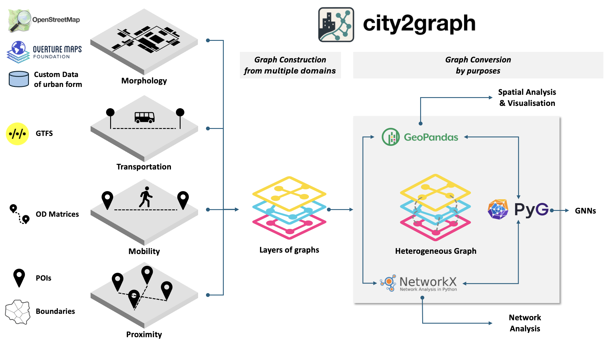
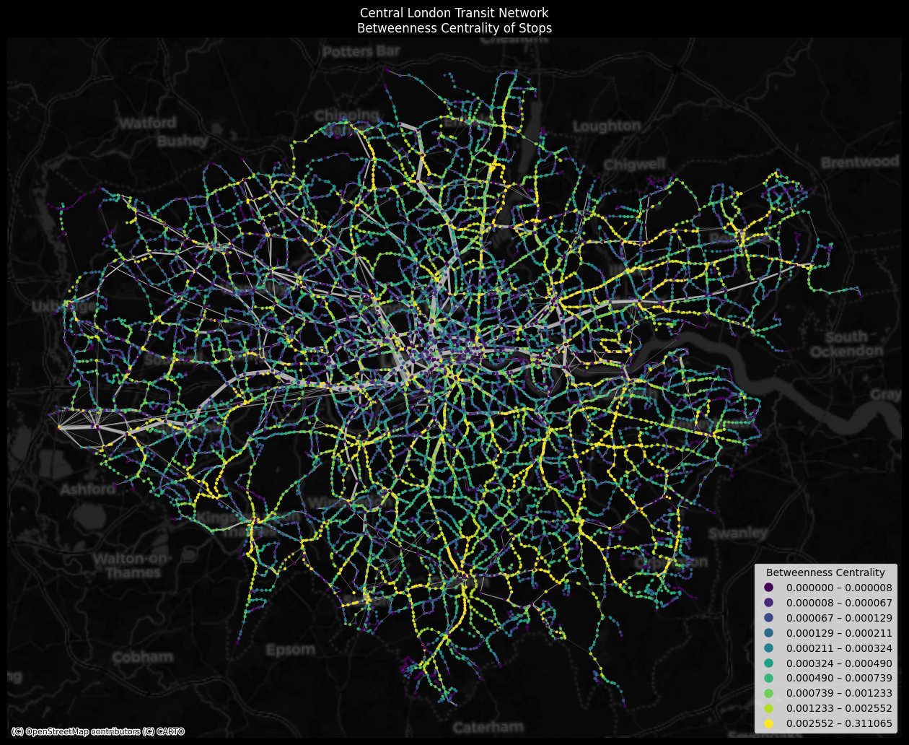

# City2Graph

<p align="center">
  
</p>

**City2Graph** is a Python library for converting geospatial datasets into graphs for GNN with integrated interface of [GeoPandas](https://geopandas.org/), [NetworkX](https://networkx.org/), and [Pytorch Geometric](https://pytorch-geometric.readthedocs.io/en/latest/) across multiple domains (e.g. streets, transportations, OD matrices, POI proximities, etc.). It enables researchers and practitioners to seamlessly develop advanced GeoAI and geographic data science applications.

<p align="center">
  
</p>

## Features

- Construct graphs from morphological datasets (e.g. buildings, streets, and land use from OpenStreetMap (OSM), Overture Maps, and others)
- Construct graphs from transportation datasets (e.g. public transport of buses, trams, and trains from GTFS)
- Construct graphs from contiguity datasets (e.g. land use, land cover, and administrative boundaries)
- Construct graphs from mobility datasets (e.g. bike-sharing, migration, and pedestrian flows)
- Convert geospatial data (GeoPandas / NetworkX) into tensors (PyTorch Geometric's Data and HeteroData) for graph representation learning, such as Graph Neural Networks (GNNs)

**City2Graph** empowers researchers and practitioners in GeoAI, Urban Analytics, and Spatial Data Science to build advanced applications. A key distinction of this library is its ability to model complex urban systems by handling multiple geospatial relations as **heterogeneous graphs**. It bridges the gap between traditional GIS and modern Graph Neural Networks (GNNs) for a variety of applications. By supporting standard libraries like PyTorch Geometric, it enables seamless integration into deep learning workflows for Graph Representation Learning. With its versatile graph construction interface, this library can also be used for network analysis of urban systems from multiple geospatial relations, such as multi-modal accessibility (e.g. isochrone with street networks + public transport networks).

[](https://github.com/c2g-dev/city2graph)
[](https://badge.fury.io/py/city2graph)
[](https://anaconda.org/conda-forge/city2graph)
[](https://pepy.tech/projects/city2graph)
[](https://doi.org/10.5281/zenodo.15858845)
[](https://github.com/c2g-dev/city2graph/blob/main/LICENSE)
[](https://anaconda.org/conda-forge/city2graph)
[](https://codecov.io/gh/c2g-dev/city2graph)
[](https://github.com/astral-sh/ruff)

## Quickstart

Install City2Graph using pip (recommended):

```bash
pip install city2graph
```

For graph neural network functionality (PyTorch, PyTorch Geometric):

```bash
pip install "city2graph[cpu]"  # CPU only
pip install "city2graph[cu130]"  # For CUDA 13.0 (GPU)
```

Supported CUDA options: cu118, cu124, cu126, cu128, cu130

Or install with conda (core functionality only):

```bash
conda install -c conda-forge city2graph
```

To add PyTorch and PyTorch Geometric (conda):

```bash
conda install -c conda-forge pytorch pytorch_geometric
```

For CUDA-enabled PyTorch (conda):

```bash
conda install -c conda-forge pytorch=2.7.1=*cuda128*
conda install -c conda-forge pytorch_geometric
```

!!! warning
    As conda is not officially supported by PyTorch and PyTorch Geometric anymore, pip is recommended for full PyTorch support. See [Installation](installation.md) for details.

## Examples

```python
import city2graph as c2g
import geopandas as gpd
import pandas as pd
from pathlib import Path
```

**Metapath**

```python
# Define metapath: amenity -> segment -> segment -> amenity (3-hop in this case)
metapaths = [[("amenity", "is_nearby", "segment"),
              ("segment", "connects", "segment"),
              ("segment", "connects", "segment"),
              ("segment", "is_nearby", "amenity")]]

# Add metapath-derived edges to connect amenities through street networks
nodes_with_metapaths, edges_with_metapaths = c2g.add_metapaths(
    (combined_nodes, combined_edges),
    metapaths,
    edge_attr="distance_m",
    edge_attr_agg="sum"
)
```

<p align="center">
  
</p>

For details, see [Examples](examples/add_metapaths.ipynb)

**Morphology**

```python
morphological_nodes, morphological_edges = c2g.morphological_graph(
   buildings_gdf,
   segments_gdf,
   center_point,
   distance=500
 )
```

<p align="center">
  
</p>

For details, see [Examples](examples/morphological_graph_from_overturemaps.ipynb)

**Transportation**

```python
sample_gtfs_path = Path("./itm_london_gtfs.zip")
gtfs_data = c2g.load_gtfs(sample_gtfs_path)

travel_summary_nodes, travel_summary_edges = c2g.travel_summary_graph(
   gtfs_data, calendar_start="20250601", calendar_end="20250601")
```

<p align="center">
  
</p>

For details, see [Examples](examples/gtfs.ipynb)

**Mobility**

```python
# Load zones (e.g., MSOA boundaries) and OD matrix data
od_data = pd.read_csv("od_matrix.csv")
zones_gdf = gpd.read_file("zones.gpkg")

# Convert OD matrix to graph
od_nodes, od_edges = c2g.od_matrix_to_graph(
    od_data,
    zones_gdf,
    source_col="origin",
    target_col="destination",
    weight_cols=["flow"],
    zone_id_col="zone_id",
    directed=False
)
```

<p align="center">
  
</p>

For details, see [Examples](examples/generating_graphs_from_od_matrix.ipynb)

**Proximity**

```python
fixed_radius_graph = c2g.fixed_radius_graph(poi_gdf, radius=100)
```

<p align="center">
  <video class="desktop-limit-width" controls>
    <source src="assets/videos/gilbert_graph.mp4" type="video/mp4">
    Your browser does not support the video tag.
  </video>
</p>

```python
wax_l1_nodes, wax_l1_edges = c2g.waxman_graph(poi_gdf,
                                 distance_metric="manhattan",
                                 r0=100,
                                 beta=0.5)

wax_l2_nodes, wax_l2_edges = c2g.waxman_graph(poi_gdf,
                                 distance_metric="euclidean",
                                 r0=100,
                                 beta=0.5)

wax_net_nodes, wax_net_edges = c2g.waxman_graph(poi_gdf,
                                 distance_metric="network",
                                 r0=100,
                                 beta=0.5,
                                 network_gdf=segments_gdf.to_crs(epsg=6677))
```

<p align="center">
  
</p>

```python
nodes_dict = {
   "restaurants": poi_gdf,
   "hospitals": hospital_gdf,
   "commercial": commercial_gdf
}

# Generate proximity edges between layers using KNN method
proximity_nodes, proximity_edges = c2g.bridge_nodes(
   nodes_dict,
   proximity_method="knn",
   k=5,
   distance_metric="euclidean"
)
```

<p align="center">
  
</p>

```python
# Build a contiguity graph (Queen or Rook) from polygonal zones
wn_q_nodes, wn_q_edges = c2g.contiguity_graph(
    wards_gdf,
    contiguity="queen",        # or "rook"
    distance_metric="euclidean" # or "manhattan", "network"
)
```

```python
# Link point features (e.g., POIs, stops) to containing polygons (e.g., wards)
nodes_dict, edges_dict = c2g.group_nodes(
    polygons_gdf=wards_gdf,
    points_gdf=poi_gdf,
    predicate="covered_by"      # include boundary points; alternatives: "within", "contains"
)
```

```python
# Combine contiguity edges and grouped edges into a single heterogeneous graph
combined_nodes = {
    "wards": wn_q_nodes,
    "poi": nodes_dict["poi"]
}

combined_edges = {
    ("wards", "is_contiguous_with", "wards"): wn_q_edges[("wards", "is_contiguous_with", "wards")],
    ("wards", "covers", "poi"): edges_dict[("wards", "covers", "poi")]
}

# Convert to PyG HeteroData
hetero_graph = c2g.gdf_to_pyg(combined_nodes, combined_edges)
```

<p align="center">
  
</p>

For details, see [Examples](examples/generating_graphs_by_proximity.ipynb)

## Citation

If you use City2Graph in your research, please cite it as follows:

```bibtex
@software{sato2025city2graph,
  title = {City2Graph: Transform geospatial relations into graphs for spatial network analysis and Graph Neural Networks},
  author = {Sato, Yuta},
  year = {2025},
  url = {https://github.com/c2g-dev/city2graph},
  doi = {10.5281/zenodo.15858845},
}
```

You can also find the citation information in the [CITATION.cff](https://github.com/c2g-dev/city2graph/blob/main/CITATION.cff) file in the repository, which follows the Citation File Format standard.

## Documentation

- [Installation](installation.md)
- [Examples](examples/index.md)
- [API Reference](api/index.md)
- [Contributing](contributing.md)

<p align="center">
  <a href="https://www.liverpool.ac.uk/geographic-data-science/">
    
  </a>
</p>
