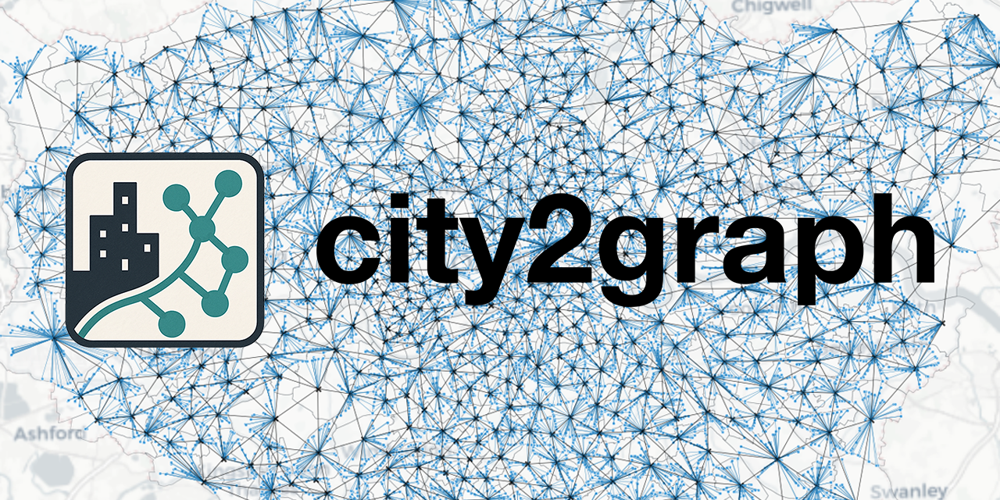
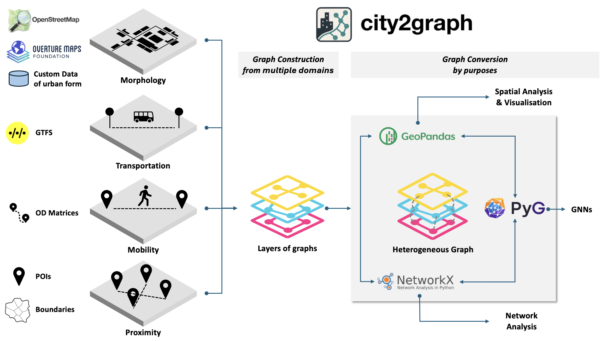
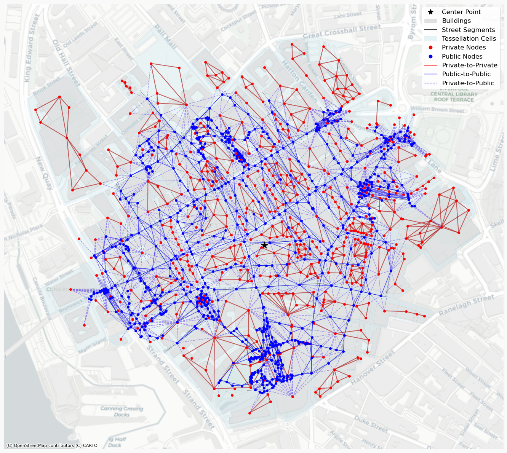
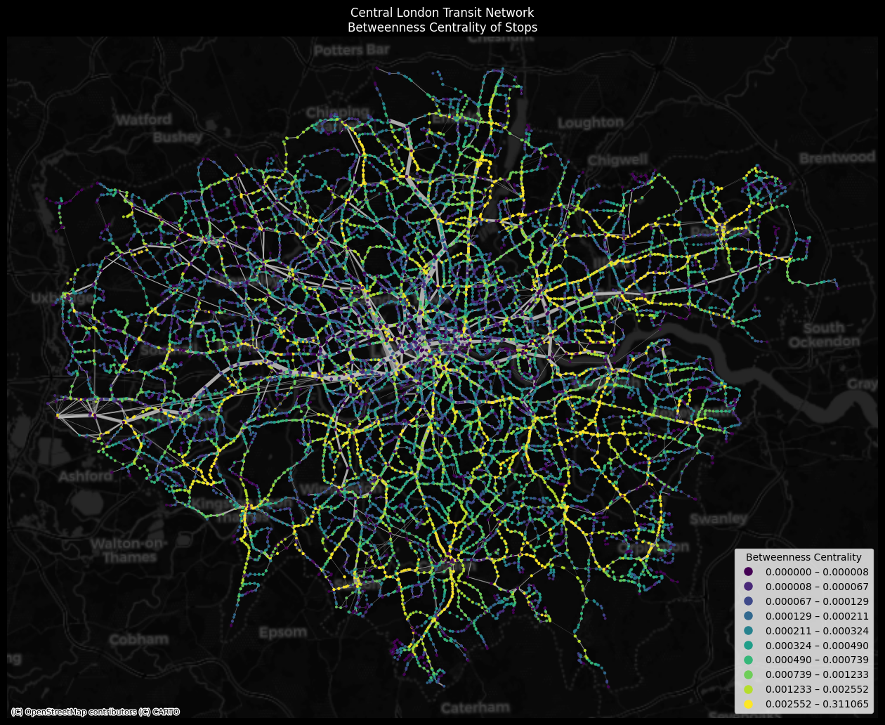
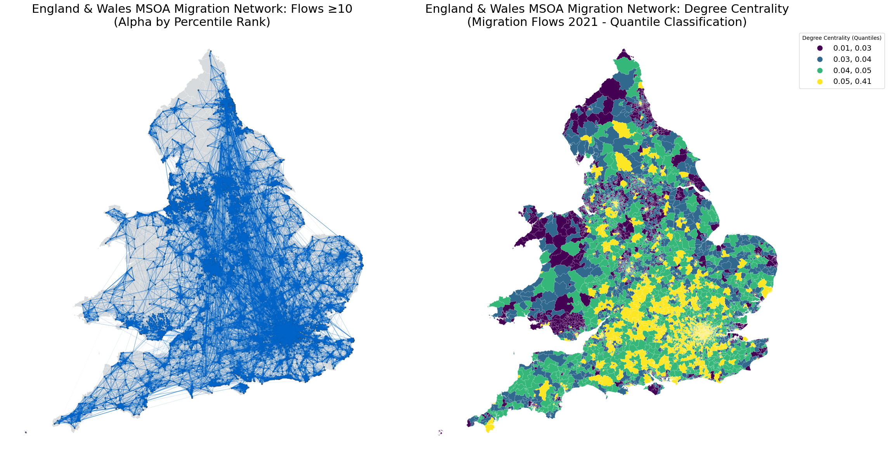
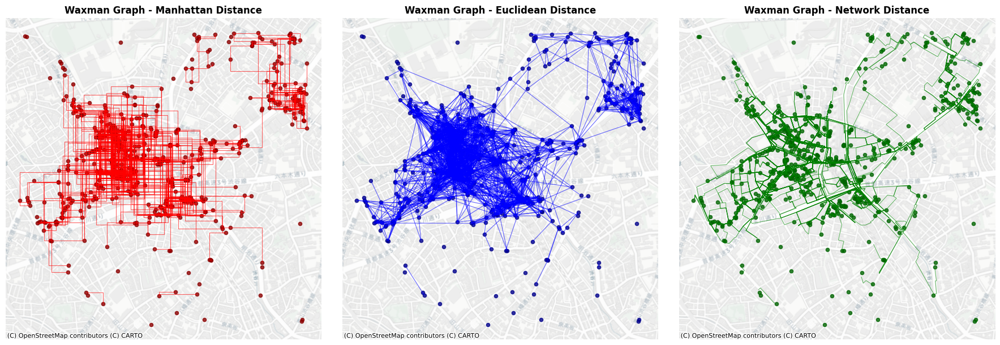
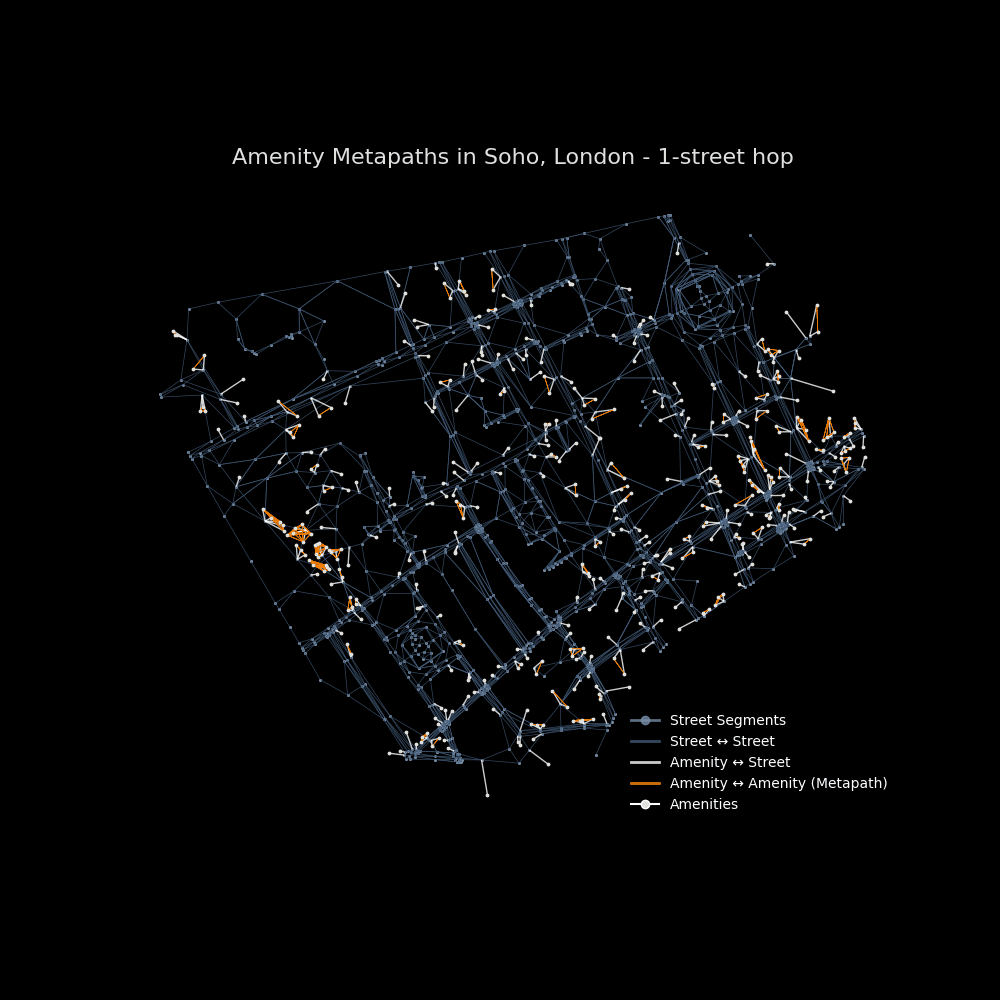

# City2Graph

<p align="center">
  
</p>
[](https://github.com/c2g-dev/city2graph)
[](https://badge.fury.io/py/city2graph)
[](https://anaconda.org/conda-forge/city2graph)
[](https://pepy.tech/projects/city2graph)
[](https://doi.org/10.5281/zenodo.15858845)
[](https://github.com/c2g-dev/city2graph/blob/main/LICENSE)
[](https://anaconda.org/conda-forge/city2graph)
[](https://codecov.io/gh/c2g-dev/city2graph)
[](https://github.com/astral-sh/ruff)

**City2Graph** turns geospatial datasets — streets, buildings, transit feeds, OD matrices, and points of interest — into graphs, with one interface that bridges [GeoPandas](https://geopandas.org/), [NetworkX](https://networkx.org/), and [PyTorch Geometric](https://pytorch-geometric.readthedocs.io/en/latest/). Load open urban data, build a graph in a few lines of code, then analyse it as a spatial network or feed it to Graph Neural Networks (GNNs).

<p align="center">
  
</p>

Use it to build graphs from:

- **Morphology**: buildings, streets, and tessellated urban fabric from OpenStreetMap and Overture Maps
- **Transportation**: GTFS public transport feeds aggregated into stop-to-stop transit graphs
- **Mobility**: origin–destination matrices and flows (migration, bike-sharing, pedestrian counts) as weighted spatial graphs
- **Proximity & contiguity**: KNN, Delaunay, Gilbert, and Waxman graphs, plus queen/rook contiguity between zones

Any of these graphs converts round-trip between GeoDataFrames, NetworkX, and PyTorch Geometric `Data`/`HeteroData` tensors. Because several geospatial relations can live in one **heterogeneous graph**, City2Graph serves both multi-modal network analysis (for example, isochrones over street plus transit networks) and training GNNs on urban systems.

For citation:

```bibtex
@software{sato2025city2graph,
  title = {City2Graph: Transform geospatial relations into graphs for spatial network analysis and Graph Neural Networks},
  author = {Sato, Yuta},
  year = {2025},
  url = {https://github.com/c2g-dev/city2graph},
  doi = {10.5281/zenodo.15858845},
}
```

## Quickstart

```bash
pip install city2graph
conda install city2graph -c conda-forge
```

For details, see [Installation](installation.md) such as supported CUDA version.

=== "Morphology"

    ```python
    import city2graph as c2g

    # Buildings + street segments -> heterogeneous morphological graph
    nodes, edges = c2g.morphological_graph(
        buildings_gdf, segments_gdf, center_point, distance=500
    )
    ```

    { .quickstart-figure }

=== "Transportation"

    ```python
    import city2graph as c2g

    gtfs = c2g.load_gtfs("itm_london_gtfs.zip")

    # Stop-to-stop travel-time graph from a GTFS feed
    nodes, edges = c2g.travel_summary_graph(
        gtfs, calendar_start="20250601", calendar_end="20250601"
    )
    ```

    { .quickstart-figure }

=== "Mobility"

    ```python
    import city2graph as c2g

    # OD matrix + zone geometries -> weighted spatial graph
    nodes, edges = c2g.od_matrix_to_graph(
        od_df, zones_gdf,
        source_col="origin", target_col="destination",
        weight_cols=["flow"], zone_id_col="zone_id",
    )
    ```

    { .quickstart-figure }

=== "Proximity"

    ```python
    import city2graph as c2g

    # Proximity graphs over points of interest
    knn_nodes, knn_edges = c2g.knn_graph(poi_gdf, k=5)
    wax_nodes, wax_edges = c2g.waxman_graph(poi_gdf, r0=100, beta=0.5)

    # Queen contiguity between polygonal zones
    w_nodes, w_edges = c2g.contiguity_graph(wards_gdf, contiguity="queen")
    ```

    { .quickstart-figure }

=== "Metapath"

    ```python
    import city2graph as c2g

    # Compose relations: amenity -> segment -> segment -> amenity
    metapaths = [[("amenity", "is_nearby", "segment"),
                  ("segment", "connects", "segment"),
                  ("segment", "is_nearby", "amenity")]]

    nodes, edges = c2g.add_metapaths(
        (nodes, edges), metapaths, edge_attr="distance_m", edge_attr_agg="sum"
    )
    ```

    { .quickstart-figure }

=== "Conversions"

    ```python
    import city2graph as c2g

    # GeoPandas -> NetworkX
    G = c2g.gdf_to_nx(nodes, edges)

    # GeoPandas -> PyTorch Geometric
    data = c2g.gdf_to_pyg(nodes, edges)

    # PyTorch Geometric -> GeoPandas
    nodes, edges = c2g.pyg_to_gdf(data)

    # PyTorch Geometric -> NetworkX
    G = c2g.pyg_to_nx(data)

    # NetworkX -> rustworkx
    G_rx = c2g.nx_to_rx(G_nx)

    # rustworkx -> NetworkX
    G_nx = c2g.rx_to_nx(G_rx)
    ```

## Examples

### Applied projects

<div class="grid cards examples-gallery" markdown>

- { .card-img }

    **[Liverpool Case Study](https://github.com/c2g-dev/city2graph-case-study)**

    ---

    A reproducible research pipeline for Liverpool: open data become heterogeneous graphs, graph autoencoders learn embeddings, and clusters characterise urban structure.

- { .card-img }

    **[Workshop: From Geospatial Data to GNNs](https://github.com/c2g-dev/city2graph-workshop)**

    ---

    *GeoAI in Practice*, a hands-on FOSS4G 2026 workshop: construct spatial networks from open data, then build a graph autoencoder pipeline for spatial clustering.

</div>

### Tutorials

<div class="grid cards examples-gallery" markdown>

- { .card-img }

    **[Metapath Construction for Heterogeneous GNNs](examples/add_metapaths.ipynb)**

    ---

    Materialise metapath edges between amenities reachable within a few street hops — the composite relations used by heterogeneous GNNs.

- { .card-img }

    **[Morphological Graphs from Overture Maps & OpenStreetMap](examples/morphological_graph_from_overturemaps.ipynb)**

    ---

    Tessellate Liverpool's urban fabric, link it to the street network, and export a heterogeneous graph to NetworkX and PyTorch Geometric.

- { .card-img }

    **[GTFS to Public Transit Graphs](examples/gtfs.ipynb)**

    ---

    Convert a raw GTFS feed for London into a travel-time graph, rank stops by betweenness centrality, and draw walk-plus-transit isochrones.

- { .card-img }

    **[OD Matrices to Mobility Graphs](examples/generating_graphs_from_od_matrix.ipynb)**

    ---

    Turn origin–destination data into spatial graphs, up to the 2021 census migration flows between all MSOAs of England and Wales.

- { .card-img }

    **[Spatial Proximity Graphs](examples/generating_graphs_by_proximity.ipynb)**

    ---

    Generate KNN, Delaunay, Gilbert, and Waxman graphs over Tokyo POIs under Euclidean, Manhattan, and network distances.

- { .card-img }

    **[How to Use Overture Maps Like OSMnx](https://medium.com/@yuta.sato.now/how-to-use-overture-maps-like-osmnx-by-city2graph-7e01d38f9f61)**

    ---

    Bring the OSMnx-like experience to Overture Maps: fetch buildings, streets, and POIs for any place and turn them into analysis-ready graphs.

</div>

[Browse all examples →](examples/index.md)

<p align="center">
  <a href="https://www.liverpool.ac.uk/geographic-data-science/">
    
  </a>
</p>
