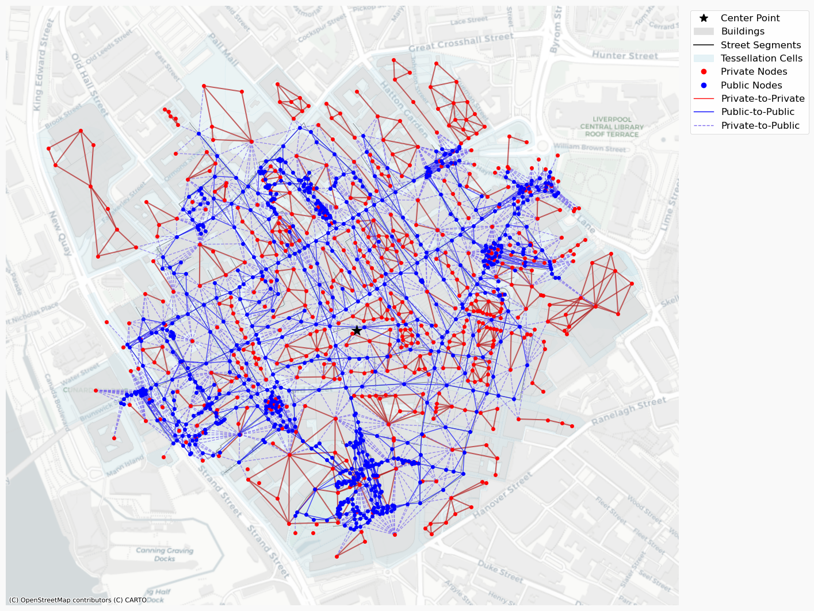

.. city2graph documentation master file

city2graph documentation
==========

.. figure:: _static/city2graph_logo_main.png
   :width: 400px
   :alt: city2graph logo
   :align: center
   :class: only-light

.. figure:: _static/city2graph_logo_main_dark.png
   :width: 400px
   :alt: city2graph logo
   :align: center
   :class: only-dark

**city2graph** is a Python library for converting datasets of geospatial relations into graphs.
It is designed to facilitate the graph data analytics in particular for urban studies and spatial analysis.
It supports `Pytorch Geometric <https://pytorch-geometric.readthedocs.io/en/latest/>`_ to enable graph representation learning, such as Graph Neural Networks (GNNs).

Features
--------

- Construct graphs from morphological datasets (e.g. buildings, streets, and land use)
- Construct graphs from transportation datasets (e.g. public transport of buses, trams, and trains)
- Construct graphs from contiguity datasets (e.g. land use, land cover, and administrative boundaries)
- Construct graphs from mobility datasets (e.g. bike-sharing, migration, and pedestrian flows)
- Convert geospatial data into pytorch tensors for graph representation learning, such as Graph Neural Networks (GNNs)

Examples
--------

.. code-block:: python

   morphological_network = city2graph.morphological_network(
      buildings_gdf,
      segments_gdf,
      center_point,
      distance=500
    )

   
   A morphological network of 500-m walking distance in Liverpool

Indices and tables
-----------------

* :ref:`genindex`
* :ref:`modindex`
* :ref:`search`
