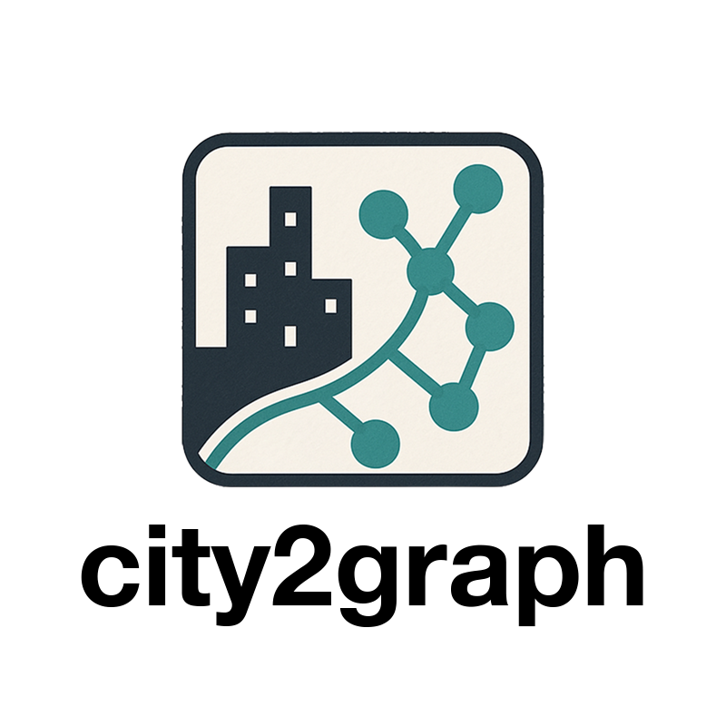
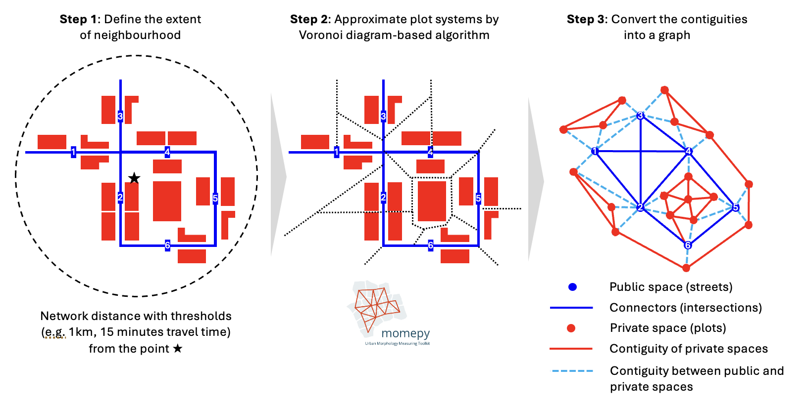

.. city2graph documentation master file

city2graph documentation
========================

.. figure:: _static/city2graph_logo_main_dark.png
   :width: 400px
   :alt: city2graph logo
   :align: center
   :class: only-dark

**city2graph** is a Python library for converting datasets of geospatial relations into graphs.
It is designed to facilitate the graph data analytics in particular for urban studies and spatial analysis.
It supports `Pytorch Geometric <https://pytorch-geometric.readthedocs.io/en/latest/>`_ to enable graph representation learning, such as Graph Neural Networks (GNNs).

.. figure:: _static/scope.png
   :width: 1000px
   :alt: Overview scope of city2graph
   :align: center

Features
--------

- Construct graphs from morphological datasets (e.g. buildings, streets, and land use)
- Construct graphs from transportation datasets (e.g. public transport of buses, trams, and trains)
- Construct graphs from contiguity datasets (e.g. land use, land cover, and administrative boundaries)
- Construct graphs from mobility datasets (e.g. bike-sharing, migration, and pedestrian flows)
- Convert geospatial data into tensors (PyTorch Geometric's Data and HeteroData) for graph representation learning, such as Graph Neural Networks (GNNs)

Examples
--------

**Morphology**

.. code-block:: python

   morphological_graph = city2graph.morphological_graph(
      buildings_gdf,
      segments_gdf,
      center_point,
      distance=500
    )

   A morphological graph of 500m walking distance in Liverpool

>> For details, see :doc:`examples/morphological_networks_from_overturemaps`

**Transportation**

.. code-block:: python

   sample_gtfs_path = Path("./itm_london_gtfs.zip")
   gtfs_data = city2graph.load_gtfs(sample_gtfs_path)

   travel_summary_nodes, travel_summary_edges = city2graph.travel_summary_graph(
      gtfs_data, calendar_start="20250601", calendar_end="20250601")

.. figure:: _static/trav_sum_network_overview.png
   :width: 1000px
   :alt: A bus transportation graph in London
   :align: center

   A travel summary graph of bus transportation between stops in London

>> For details, see :doc:`examples/gtfs`

**Proximity**

.. code-block:: python

   fixed_radius_graph = city2graph.fixed_radius_graph(poi_gdf, radius=100)

.. raw:: html

   

     <video style="width:100%; max-width:800px;" controls>
       <source src="_static/gilbert_graph.mp4" type="video/mp4">
       Your browser does not support the video tag.
     </video>
   

.. code-block:: python

   wax_l1_nodes, wax_l1_edges = city2graph.waxman_graph(poi_gdf,
                                    distance_metric="manhattan",
                                    r0=100,
                                    beta=0.5)

   wax_l2_nodes, wax_l2_edges = city2graph.waxman_graph(poi_gdf,
                                    distance_metric="euclidean",
                                    r0=100,
                                    beta=0.5)

   wax_net_nodes, wax_net_edges = city2graph.waxman_graph(poi_gdf,
                                    distance_metric="network",
                                    r0=100,
                                    beta=0.5,
                                    network_gdf=segments_gdf.to_crs(epsg=6677))

.. figure:: _static/waxman_graph.png
   :width: 1000px
   :alt: Waxman graph of points of interest in Liverpool
   :align: center

.. code-block:: python

   nodes_dict = {
      "restaurants": poi_gdf,
      "hospitals": hospital_gdf,
      "commercial": commercial_gdf
   }

   # Generate proximity edges between layers using KNN method
   proximity_nodes, proximity_edges = city2graph.bridge_nodes(
      nodes_dict,
      proximity_method="knn",
      k=5,
      distance_metric="euclidean"
   )

.. figure:: _static/bridge_nodes.png
   :width: 1000px
   :alt: Bridge nodes connecting different layers of POIs
   :align: center

>> For details, see :doc:`examples/generating_graphs_by_proximity`

Documentation
------------

.. toctree::
   :maxdepth: 2
   :caption: Contents:

   installation
   examples/index
   api/index
   contributing

Indices and tables
-----------------

* :ref:`genindex`
* :ref:`modindex`
* :ref:`search`
