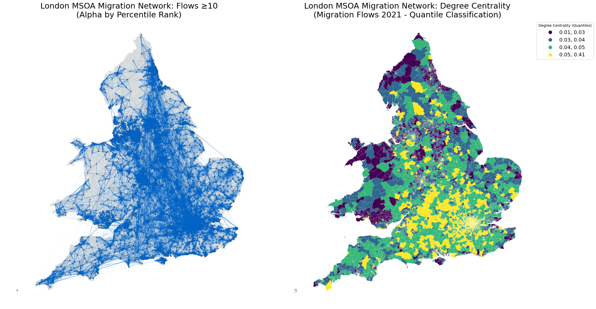

.. city2graph documentation master file

city2graph
==========
.. figure:: _static/city2graph_logo_main.png
   :width: 400px
   :alt: city2graph logo
   :align: center
   :class: only-light

.. figure:: _static/city2graph_logo_main_dark.png
   :width: 400px
   :alt: city2graph logo
   :align: center
   :class: only-dark

**city2graph** is a Python library for converting geospatial datasets into graphs for GNN with integrated interface of `GeoPandas <https://geopandas.org/>`_, `NetworkX <https://networkx.org/>`_, and `Pytorch Geometric <https://pytorch-geometric.readthedocs.io/en/latest/>`_ across multiple domains (e.g. streets, transportations, OD matrices, POI proximities, etc.). It enables researchers and practitioners to seamlessly develop advanced GeoAI and geographic data science applications.

.. figure:: _static/scope.png
   :width: 1000px
   :alt: Overview scope of city2graph
   :align: center

Features
--------

- Construct graphs from morphological datasets (e.g. buildings, streets, and land use from OpenStreetMap (OSM), Overture Maps, and others)
- Construct graphs from transportation datasets (e.g. public transport of buses, trams, and trains from GTFS)
- Construct graphs from contiguity datasets (e.g. land use, land cover, and administrative boundaries)
- Construct graphs from mobility datasets (e.g. bike-sharing, migration, and pedestrian flows)
- Convert geospatial data (GeoPandas / NetworkX) into tensors (PyTorch Geometric's Data and HeteroData) for graph representation learning, such as Graph Neural Networks (GNNs)

Keywords
--------

GeoAI, Graph Neural Networks, GNNs, PyTorch Geometric, Geospatial Analysis, Urban Analytics, Spatial Data Science, Urban Mobility, Transportation Networks, Geospatial Foundation Models, Digital Twin, Urban Informatics, Geographic Data Science, Graph Representation Learning, Urban Planning and Design, Urban Morphology.

.. |PyPI| image:: https://badge.fury.io/py/city2graph.svg
   :target: https://badge.fury.io/py/city2graph
   :alt: PyPI version

.. |conda-forge| image:: https://anaconda.org/conda-forge/city2graph/badges/version.svg
   :target: https://anaconda.org/conda-forge/city2graph
   :alt: conda-forge Version

.. |PyPIDownloads| image:: https://static.pepy.tech/badge/city2graph
   :target: https://pepy.tech/projects/city2graph
   :alt: PyPI Downloads

.. |DOI| image:: https://zenodo.org/badge/DOI/10.5281/zenodo.15858845.svg
   :target: https://doi.org/10.5281/zenodo.15858845
   :alt: DOI

.. |License| image:: https://img.shields.io/badge/License-BSD_3--Clause-blue.svg
   :target: https://github.com/c2g-dev/city2graph/blob/main/LICENSE
   :alt: License

.. |Platform| image:: https://anaconda.org/conda-forge/city2graph/badges/platforms.svg
   :target: https://anaconda.org/conda-forge/city2graph
   :alt: Platform

.. |codecov| image:: https://codecov.io/gh/c2g-dev/city2graph/graph/badge.svg?token=2R449G75Z0
   :target: https://codecov.io/gh/c2g-dev/city2graph
   :alt: codecov

.. |Ruff| image:: https://img.shields.io/endpoint?url=https://raw.githubusercontent.com/astral-sh/ruff/main/assets/badge/v2.json
   :target: https://github.com/astral-sh/ruff
   :alt: Ruff

|PyPI| |conda-forge| |PyPIDownloads| |DOI| |License| |Platform| |codecov| |Ruff|

Quickstart
----------

Install city2graph using pip (recommended):

.. code-block:: bash

   pip install city2graph

For graph neural network functionality (PyTorch, PyTorch Geometric):

.. code-block:: bash

   pip install "city2graph[cpu]"  # CPU only
   pip install "city2graph[cu128]"  # For CUDA 12.8 (GPU)

Supported CUDA options: cu118, cu124, cu126, cu128

Or install with conda (core functionality only):

.. code-block:: bash

   conda install -c conda-forge city2graph

To add PyTorch and PyTorch Geometric (conda):

.. code-block:: bash

   conda install -c conda-forge pytorch pytorch_geometric

For CUDA-enabled PyTorch (conda):

.. code-block:: bash

   conda install -c conda-forge pytorch=2.7.1=*cuda128*
   conda install -c conda-forge pytorch_geometric

.. warning::
   As conda is not officially supported by PyTorch and PyTorch Geometric anymore, pip is recommended for full PyTorch support. See :doc:`installation` for details.

Examples
--------

**Morphology**

.. code-block:: python

   morphological_nodes, morphological_edges = city2graph.morphological_graph(
      buildings_gdf,
      segments_gdf,
      center_point,
      distance=500
    )

.. figure:: _static/morph_net_overview.png
   :width: 1000px
   :alt: A morphological graph in Liverpool
   :align: center

   A morphological graph of 500m walking distance in Liverpool

>> For details, see :doc:`examples/morphological_graph_from_overturemaps`

**Transportation**

.. code-block:: python

   sample_gtfs_path = Path("./itm_london_gtfs.zip")
   gtfs_data = city2graph.load_gtfs(sample_gtfs_path)

   travel_summary_nodes, travel_summary_edges = city2graph.travel_summary_graph(
      gtfs_data, calendar_start="20250601", calendar_end="20250601")

.. figure:: _static/trav_sum_network_overview.png
   :width: 1000px
   :alt: A bus transportation graph in London
   :align: center

   A travel summary graph of bus transportation between stops in London

>> For details, see :doc:`examples/gtfs`

**Mobility**

.. code-block:: python

   # Load zones (e.g., MSOA boundaries) and OD matrix data
   od_data = pd.read_csv("od_matrix.csv")
   zones_gdf = gpd.read_file("zones.gpkg")

   # Convert OD matrix to graph
   od_nodes, od_edges = city2graph.od_matrix_to_graph(
       od_data,
       zones_gdf,
       source_col="origin",
       target_col="destination",
       weight_cols=["flow"],
       zone_id_col="zone_id",
       directed=False
   )

   An OD matrix graph showing migration flows and degree centrality in England and Wales

>> For details, see :doc:`examples/generating_graphs_from_od_matrix`

**Proximity**

.. code-block:: python

   fixed_radius_graph = city2graph.fixed_radius_graph(poi_gdf, radius=100)

.. raw:: html

   

     <video style="width:100%; max-width:800px;" controls>
       <source src="_static/gilbert_graph.mp4" type="video/mp4">
       Your browser does not support the video tag.
     </video>
   

.. code-block:: python

   wax_l1_nodes, wax_l1_edges = city2graph.waxman_graph(poi_gdf,
                                    distance_metric="manhattan",
                                    r0=100,
                                    beta=0.5)

   wax_l2_nodes, wax_l2_edges = city2graph.waxman_graph(poi_gdf,
                                    distance_metric="euclidean",
                                    r0=100,
                                    beta=0.5)

   wax_net_nodes, wax_net_edges = city2graph.waxman_graph(poi_gdf,
                                    distance_metric="network",
                                    r0=100,
                                    beta=0.5,
                                    network_gdf=segments_gdf.to_crs(epsg=6677))

.. figure:: _static/waxman_graph.png
   :width: 1000px
   :alt: Waxman graph of points of interest in Liverpool
   :align: center

.. code-block:: python

   nodes_dict = {
      "restaurants": poi_gdf,
      "hospitals": hospital_gdf,
      "commercial": commercial_gdf
   }

   # Generate proximity edges between layers using KNN method
   proximity_nodes, proximity_edges = city2graph.bridge_nodes(
      nodes_dict,
      proximity_method="knn",
      k=5,
      distance_metric="euclidean"
   )

.. figure:: _static/bridge_nodes.png
   :width: 1000px
   :alt: Bridge nodes connecting different layers of POIs
   :align: center

>> For details, see :doc:`examples/generating_graphs_by_proximity`

Citation
--------

If you use city2graph in your research, please cite it as follows:

.. code-block:: bibtex

   @software{sato2025city2graph,
     title = {city2graph: Transform geospatial relations into graphs for spatial network analysis and Graph Neural Networks},
     author = {Sato, Yuta},
     year = {2025},
     url = {https://github.com/c2g-dev/city2graph},
     doi = {10.5281/zenodo.15858845},
   }

You can also use the DOI to cite a specific version: |DOI|

Alternatively, you can find the citation information in the `CITATION.cff <https://github.com/c2g-dev/city2graph/blob/main/CITATION.cff>`_ file in the repository, which follows the Citation File Format standard.

Documentation
------------

.. toctree::
   :maxdepth: 2
   :caption: Contents:

   installation
   examples/index
   api/index
   contributing

Indices and tables
-----------------

* :ref:`genindex`
* :ref:`modindex`
* :ref:`search`

.. image:: http://city2graph.net/_static/gdsl.png
   :target: https://www.liverpool.ac.uk/geographic-data-science/
   :alt: GeoGraphic Data Science Lab
   :align: center
